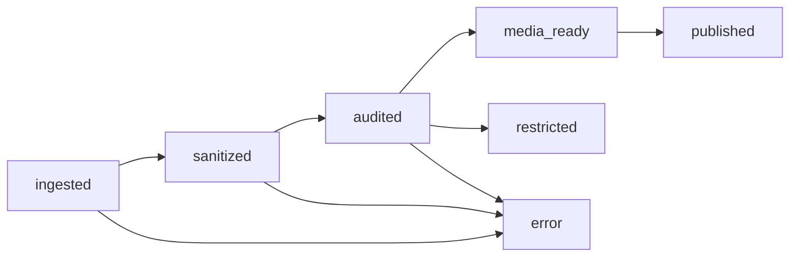
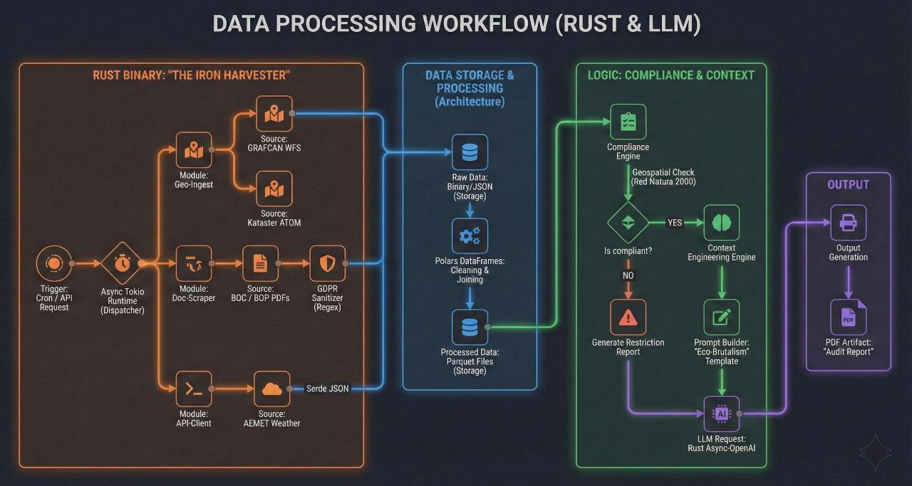

# Architecture Documentation

## Core Philosophy: Rust-First with Isolated AI
The system follows a **Correctness-by-Construction** approach. In high-regulatory environments like real estate compliance, "likely correct" is insufficient. 

We use **Rust** to build the backbone of the pipeline, providing:
1.  **Safety:** Memory safety and compile-time guarantees for data integrity.
2.  **Performance:** Massively parallel data harvesting without the overhead of heavy runtimes.
3.  **Governance:** Explicit type contracts that prevent PII from leaking to AI models.

**Python** is treated as a specialized tool for inference, not as the architectural foundation. It is isolated behind a secure bridge (`PyO3`), used only for LLM orchestration and computer vision tasks.

---

## The Four-Module Pipeline

### Module A: The Harvester
*   **Responsibility:** Parallel data ingestion from government sources.
*   **Tech:** Rust (`Spider_rs`, `Tokio`), `Polars`.
*   **Key Decision:** Rate-limiting and polite harvesting protocols are implemented directly in Rust. This eliminates the need for expensive browser automation (Playwright/Selenium) in 90% of use cases, keeping the binary self-contained and fast.

### Module B: The Auditor
*   **Responsibility:** Deterministic geospatial and legal compliance.
*   **Tech:** `PostGIS`, `Qdrant`, `Polars`.
*   **Key Decision:** **Deterministic Compliance.** We do not ask the LLM *if* a property is in a restricted zone (e.g., *Red Natura 2000*). We check this directly in PostGIS. The LLM only receives the *result* to generate a readable summary. Hallucination risk on zoning law is zero.

### Module C: The Studio
*   **Responsibility:** AI media generation and asset restoration.
*   **Tech:** Python (`OpenCV`, `Vertex AI`), `FFmpeg`.
*   **Key Decision:** Inference Isolation. Media processing happens in a dedicated Python environment called via the Rust Nexus. This ensures that the heavy AI dependencies (TensorFlow/PyTorch) do not bloat the core business logic binary.

### Module D: The Nexus
*   **Responsibility:** Delivery and Real-time Dashboard.
*   **Tech:** `Astro` (Server Islands), `Supabase`, `Axum`.
*   **Key Decision:** State Machine Protocol. Every property record has an atomic status. Transitions are strictly defined in the database schema, preventing "impossible states" like publishing a report before it has been audited.

---

## State Management Flow

---

## System Overview Diagram

---

## Compliance Engine Details
For details on how the GDPR filter works at the compiler level, see [docs/gdpr-architecture.md](./docs/gdpr-architecture.md).
